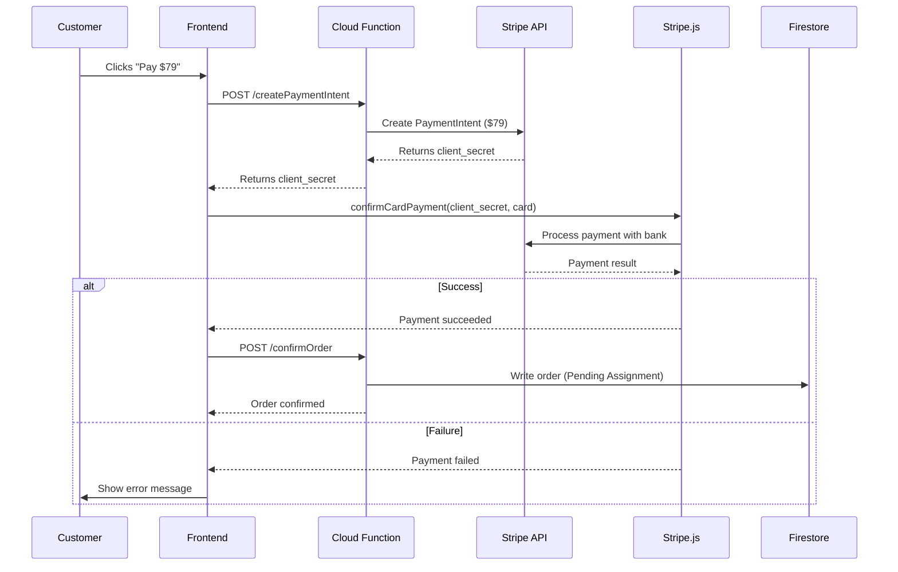

# Real Payment Integration Guide — Lyricastudios

> [!IMPORTANT]
> This document outlines how to transition from the current **mock payment system** to a **production-ready payment processor** when the platform is ready for launch.

## Current State (Mock)

- Card data is handled entirely in frontend JavaScript
- A 2-second `setTimeout` simulates bank processing
- Any card number = success; `4000 0000 0000 0000` = failure
- Orders are written to Firestore directly from the client

## Production Architecture

### Recommended: Stripe (handles Card + Stripe + can replace PayPal)

**Cost:** ~2.9% + $0.30 per transaction (~$2.59 per $79 order)

#### Prerequisites
1. Create a Stripe account at [stripe.com](https://stripe.com)
2. Grab your **Publishable Key** (frontend) and **Secret Key** (backend)
3. Stripe provides **test keys** for development — use those first

#### Flow



### What Changes Are Needed

| Component | File | Change |
|---|---|---|
| **Frontend** | `src/main.js` | Replace `setTimeout` mock with `Stripe.js` SDK calls |
| **Frontend** | `index.html` | Add `<script src="https://js.stripe.com/v3/">` |
| **Backend** | `functions/index.js` | New Firebase Cloud Function: `createPaymentIntent` |
| **Backend** | `functions/index.js` | New Firebase Cloud Function: `confirmOrder` (writes to Firestore) |
| **Config** | `firebase.json` | Add `"functions"` config block |
| **Security** | `firestore.rules` | Lock down `orders` collection — only Cloud Functions can write |

### Firebase Cloud Function Example

```javascript
// functions/index.js
const functions = require('firebase-functions');
const admin = require('firebase-admin');
const stripe = require('stripe')(functions.config().stripe.secret_key);

admin.initializeApp();

exports.createPaymentIntent = functions.https.onCall(async (data, context) => {
  const paymentIntent = await stripe.paymentIntents.create({
    amount: 7900, // $79.00 in cents
    currency: 'usd',
    metadata: {
      customerName: data.name,
      genre: data.genre,
      occasion: data.occasion
    }
  });

  return { clientSecret: paymentIntent.client_secret };
});

exports.confirmOrder = functions.https.onCall(async (data, context) => {
  // Verify the payment was actually successful with Stripe
  const paymentIntent = await stripe.paymentIntents.retrieve(data.paymentIntentId);
  
  if (paymentIntent.status !== 'succeeded') {
    throw new functions.https.HttpsError('failed-precondition', 'Payment not completed');
  }

  // Write order to Firestore (server-side, tamper-proof)
  await admin.firestore().collection('orders').add({
    customerData: data.formData,
    status: 'Pending Assignment',
    assignedArtistId: null,
    paymentIntentId: data.paymentIntentId,
    timestamps: { createdAt: admin.firestore.FieldValue.serverTimestamp() },
    assets: {}
  });

  return { success: true };
});
```

### Frontend Stripe.js Example

```javascript
// In src/main.js — replace processPayment()
const stripe = Stripe('pk_test_YOUR_PUBLISHABLE_KEY');

async function processPayment() {
  // 1. Call Cloud Function to create PaymentIntent
  const createPayment = httpsCallable(functions, 'createPaymentIntent');
  const { data } = await createPayment(window.currentOrderData);

  // 2. Confirm payment with Stripe.js
  const { error, paymentIntent } = await stripe.confirmCardPayment(data.clientSecret, {
    payment_method: {
      card: cardElement, // Stripe Elements card input
      billing_details: { name: document.getElementById('pay-name').value }
    }
  });

  if (error) {
    // Show error to customer
    document.getElementById('payment-error').textContent = error.message;
  } else if (paymentIntent.status === 'succeeded') {
    // 3. Confirm order in Firestore via Cloud Function
    const confirmOrder = httpsCallable(functions, 'confirmOrder');
    await confirmOrder({
      paymentIntentId: paymentIntent.id,
      formData: window.currentOrderData
    });
    alert('Payment Successful!');
  }
}
```

---

## Alternative: PayPal

**Cost:** ~2.9% + $0.49 per transaction

- Uses PayPal JavaScript SDK on frontend
- Server-side order creation via Cloud Functions
- Can coexist with Stripe (different tab in the UI)

---

## Setup Commands (When Ready)

```bash
# 1. Initialize Firebase Functions
firebase init functions

# 2. Install Stripe SDK in functions folder
cd functions && npm install stripe

# 3. Set Stripe secret key in Firebase config
firebase functions:config:set stripe.secret_key="sk_test_YOUR_SECRET_KEY"

# 4. Deploy functions
firebase deploy --only functions

# 5. Deploy Firestore security rules
firebase deploy --only firestore:rules
```

## Testing with Stripe Test Cards

| Card Number | Result |
|---|---|
| `4242 4242 4242 4242` | ✅ Success |
| `4000 0000 0000 0002` | ❌ Declined |
| `4000 0000 0000 9995` | ❌ Insufficient funds |
| `4000 0027 6000 3184` | ⚠️ Requires 3D Secure authentication |
